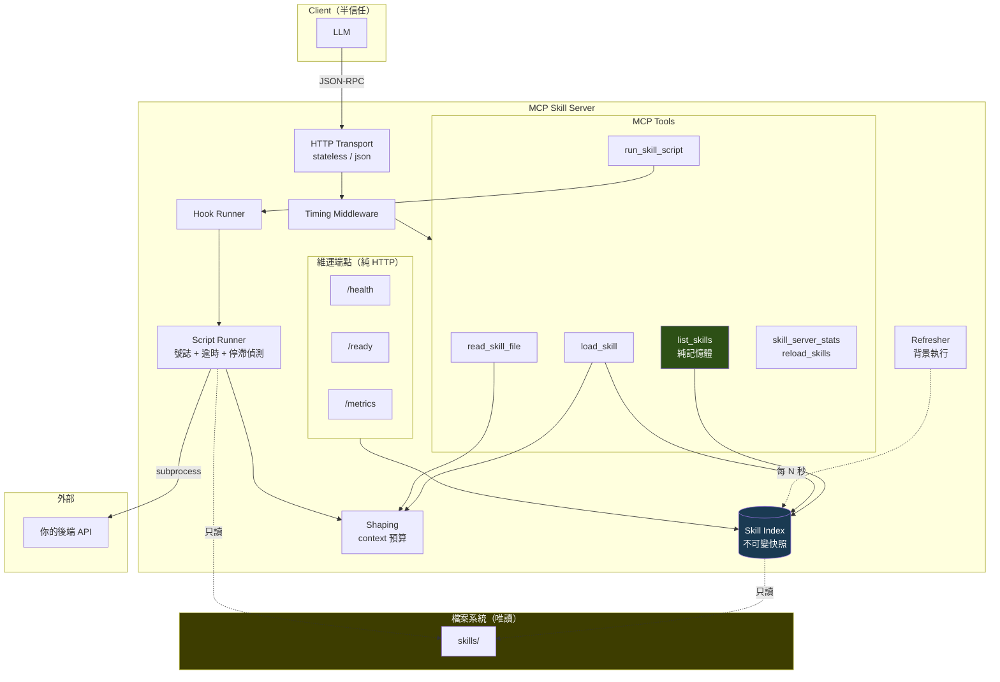
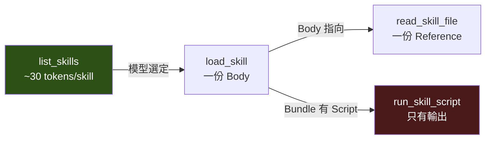
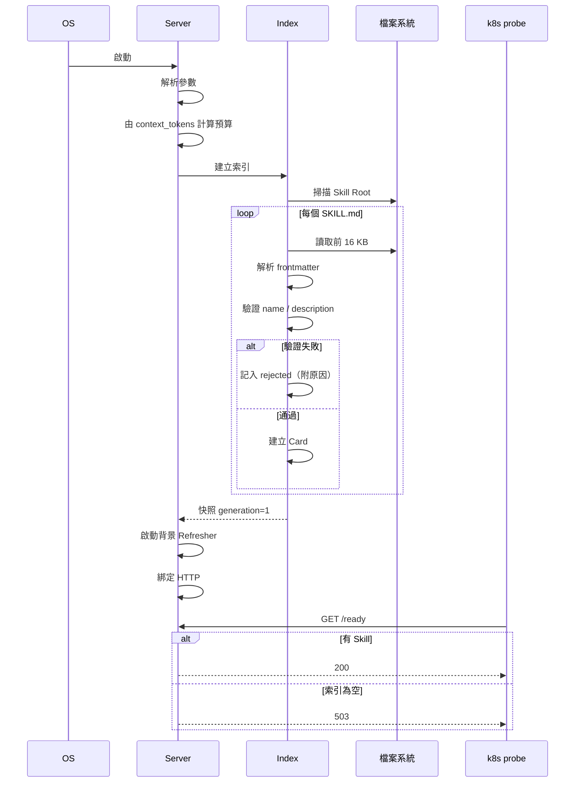
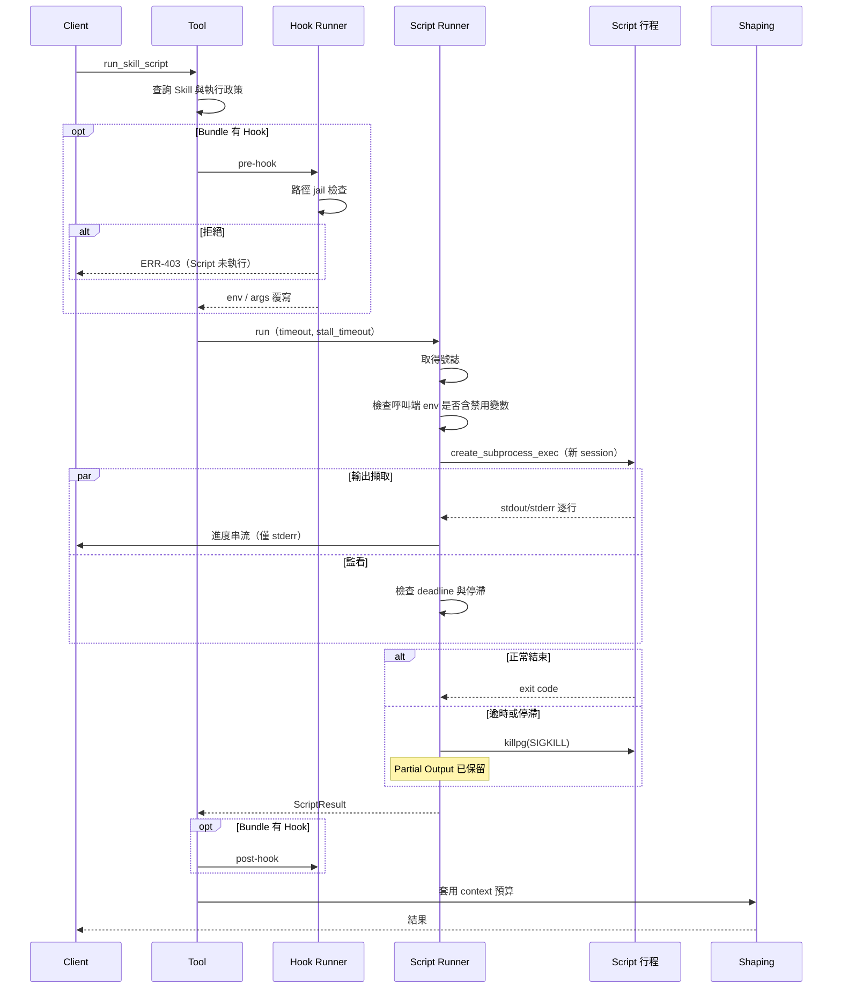
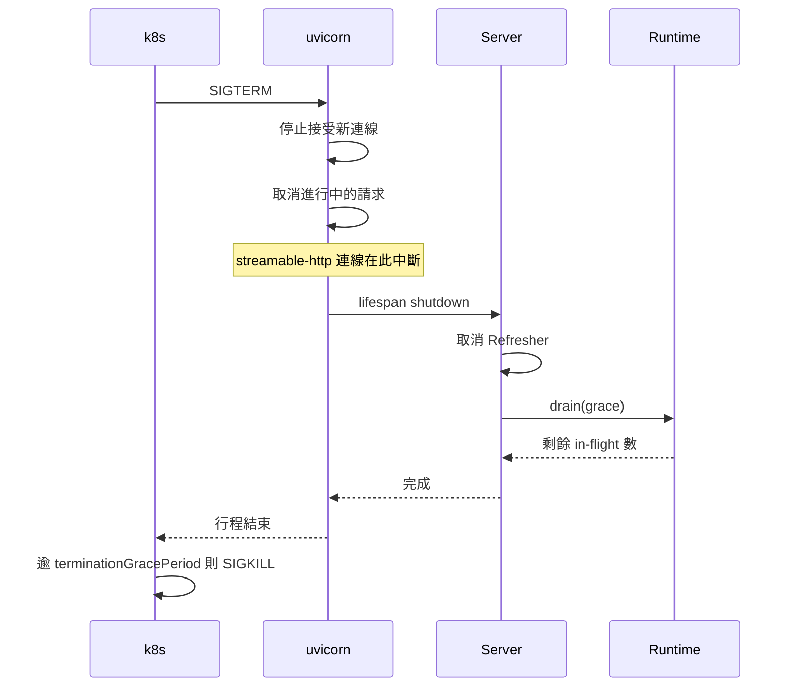

# RFC-01：術語與整體架構

## 1. 術語

本章定義的術語在全部規範中具有一致意義。以 **粗體** 標示的詞在其他章節出現時
即指本章定義。

### 1.1 核心實體

| 術語 | 定義 |
|---|---|
| **Skill** | 一個目錄，內含 `SKILL.md` 與選用的 `scripts/`、`references/`、`hooks/`。是揭露給模型的最小單位。 |
| **Skill Root** | 服務掃描 Skill 的根目錄。一個服務 MAY 有多個 Skill Root。 |
| **Manifest** | `SKILL.md` 開頭以 `---` 圍住的 YAML frontmatter。描述 Skill 而非其內容。 |
| **Body** | `SKILL.md` 中 frontmatter 之後的 Markdown。模型呼叫 `load_skill` 才會取得。 |
| **Card** | Skill 的最小揭露形式：name、description，以及選用的 tags 與 scripts。`list_skills` 只回傳 Card。 |
| **Script** | `scripts/` 下的可執行檔案。唯一可被執行的位置。 |
| **Reference** | `references/` 下的檔案。僅在 Body 指向時才由模型讀取。 |
| **Hook** | `hooks/pre.*` 或 `hooks/post.*`。在 Script 執行前後強制執行的檢查。 |
| **Bundle** | 一個 Skill 目錄下的所有檔案總稱。 |

### 1.2 執行與協定

| 術語 | 定義 |
|---|---|
| **Server** | 實作本規範、透過 MCP 協定提供 Skill 的行程。 |
| **Client** | 透過 MCP 協定呼叫 Server 的一方。**在本規範中一律視為半信任**。 |
| **Caller** | 發起一次工具呼叫的實體。實務上是 LLM。 |
| **Runtime** | Server 中負責執行 Script 的元件。 |
| **Transport** | MCP 訊息的傳輸方式。本規範只規範 `http`（streamable-http）。 |
| **Tool** | Server 透過 MCP 揭露的可呼叫函式。 |
| **Resource** | Server 透過 MCP 揭露的可讀取內容，以 URI 定址。 |
| **Capability** | Server 宣告支援的協定功能。 |
| **Context Budget** | 單次工具結果允許佔用的 Client context 上限，以位元組表示。 |
| **Progressive Disclosure** | 分層揭露機制：Card → Body → Reference → Script 輸出。 |

### 1.3 執行狀態

| 術語 | 定義 |
|---|---|
| **Status** | Script 執行的結果分類：`ok`、`failed`、`timeout`、`stalled`。 |
| **Stall** | Script 在 `stall_timeout` 內未產生任何輸出。 |
| **Ceiling** | Script 允許執行的 wall-clock 上限（`timeout`）。 |
| **Partial Output** | Script 被終止前已產生的輸出。**MUST 保留並回傳**。 |
| **In-flight** | 已開始執行但尚未結束的 Script。 |

### 1.4 驗證

| 術語 | 定義 |
|---|---|
| **Validation** | 依據本規範對 Bundle 進行的機器檢查。 |
| **Rejected Skill** | 未通過結構驗證，因此不被服務的 Skill。**MUST 可被查詢**。 |
| **Severity** | 驗證發現的嚴重度：`error`、`warning`、`info`。 |
| **Conformance Level** | 符合性等級 L1/L2/L3，見 README。 |

### 1.5 規範性參考

| 編號 | 標題 |
|---|---|
| RFC 2119 | Key words for use in RFCs to Indicate Requirement Levels |
| RFC 3986 | Uniform Resource Identifier (URI): Generic Syntax |
| RFC 8259 | The JavaScript Object Notation (JSON) Data Interchange Format |
| RFC 9110 | HTTP Semantics |
| JSON Schema Draft 2020-12 | JSON Schema Core / Validation |
| Semantic Versioning 2.0.0 | https://semver.org/spec/v2.0.0.html |
| YAML 1.2 | YAML Ain't Markup Language |
| CommonMark 0.30 | Markdown 規格 |

### 1.6 資訊性參考

| 來源 | 用途 |
|---|---|
| Model Context Protocol 規格 | 底層協定 |
| Claude Code Skill 格式 | 本規範的 Manifest 相容基礎 |
| POSIX.1-2017 | 行程、訊號、檔案系統語意 |
| Linux CFS bandwidth control | CPU 配額行為，見效能規則的理由 |

---

## 2. 整體架構

### 2.1 目標

| ID | 目標 | 可驗證條件 |
|---|---|---|
| G-1 | 每次對話的固定成本與 Skill 數量脫鉤 | 目錄回應 ≤ Context Budget，不論 Skill 總數 |
| G-2 | 服務為無狀態 | 執行期間檔案系統零變更 |
| G-3 | Script 的失敗可自我診斷 | 每個非 `ok` 結果都含 Partial Output 與可行動的 `hint` |
| G-4 | Client 無法觸及 Bundle 以外的任何內容 | 安全測試全數通過 |
| G-5 | 可在 0.1 core / 512 MB / 唯讀根檔案系統上運作 | 受限容器驗收通過 |
| G-6 | Skill 變更免重啟 | 熱載入測試通過 |

### 2.2 非目標

| 非目標 | 理由 |
|---|---|
| 執行任意使用者提供的程式碼 | 只執行 Bundle 內、由 Skill 作者提供的 Script |
| 取代容器隔離 | 本規範定義路徑與參數的防護，**不是**沙箱。不受信任的作者 MUST 以容器隔離 |
| 保存執行狀態 | 狀態屬於後端 API 與資料庫（見 RFC-041） |
| 強制 Client 的工具權限 | Server 不擁有 Client 的工具清單，只能透傳 `allowed-tools` |
| 提供通用 RPC | 只服務 Skill 揭露與 Script 執行 |

### 2.3 設計哲學

**D-1 揭露成本必須被賺取。** 每一層揭露只在前一層證明有必要時才付出。

**D-2 服務不解讀輸出。** Script 印出什麼就是答案。Server 猜測輸出語意會產生
錯誤的結論——實測顯示，自動從輸出擷取「任務代號」會把訂單的 `{"id": 123}`
誤判為任務 handle。錯誤的 handle 比沒有 handle 更糟，因為它看起來是對的。

**D-3 失敗必須說明位置。** 「逾時」不是診斷，「靜默 18 秒，最後一行是
`GET /v1/orders`」才是。

**D-4 呼叫端是半信任的。** Client 是 LLM，會被它讀到的任何文件說服。任何由
Client 控制、能改變「執行什麼」的輸入 MUST 被拒絕。

**D-5 預設值即契約。** 預設值錯誤等同於規範錯誤。預設 `--context-tokens`
為雲端模型大小，會讓地端模型每次呼叫都逾時；預設建立狀態目錄，會讓唯讀容器
中每一支 Script 都失敗。兩者都實際發生過。

### 2.4 元件架構

**RFC-001** Server MUST 將索引維持為不可變快照，讀取端 MUST 以區域變數綁定
快照後才使用，使其無需任何同步機制。

**RFC-002** 索引更新 MUST 在請求路徑之外執行。請求 MUST NOT 觸發完整重新掃描。

**RFC-003** `list_skills` 的服務路徑 MUST NOT 進行檔案系統 I/O。

### 2.5 漸進式揭露

| 層 | 工具 | 每次對話成本 | 觸發條件 |
|---|---|---|---|
| 1 | `list_skills` | 每個 Skill 約 30 tokens | 每次對話 |
| 2 | `load_skill` | 一份 Body | 模型選定之後 |
| 2b | `load_skill(section)` | 一個小節 | 只需部分時 |
| 3 | `read_skill_file` | 一份 Reference | Body 指向時 |
| 4 | `run_skill_script` | **只有輸出** | 取代讀取程式碼 |

**RFC-004** Card MUST NOT 包含 Body 的任何內容。

**RFC-005** 第 4 層 MUST 存在。Server MUST 提供執行 Script 的能力，使模型
不需要將 Script 原始碼讀入 context。

**理由**：一支 200 行的 Script 讀入 context 約 2 K tokens，且模型必須自行
重新實作；直接執行只花結果的大小，而且執行的是已測試過的程式。

### 2.6 生命週期

#### 2.6.1 初始化

**RFC-006** 初始化 MUST NOT 讀取任何 Body。索引階段 MUST 只讀取每個
`SKILL.md` 的前 16 KB。

**RFC-007** 驗證失敗的 Skill MUST NOT 中止啟動。Server MUST 記錄原因並繼續。

**RFC-008** `/ready` 在索引為零個 Skill 時 MUST 回應 503。

**理由**：索引為空通常代表路徑設定錯誤。此狀態下接受流量比拒絕更糟——模型
會取得空目錄，並據此結論這些工具不存在。

#### 2.6.2 執行流程

**RFC-009** Partial Output MUST 在所有終止路徑上保留並回傳。

**RFC-010** 輸出緩衝區 MUST 由 Runtime 持有，MUST NOT 位於讀取協程內部。

**理由**：緩衝區若位於讀取協程內，逾時取消該協程會丟棄所有已讀取的內容。
實測顯示這使得逾時只回傳空字串，無法判斷 Script 停在哪一步。

**RFC-011** Hook、Script、Hook 三者 MUST 依序執行，MUST NOT 巢狀。

**理由**：三者共用同一並行號誌，巢狀將造成死鎖。

#### 2.6.3 關閉流程

**RFC-012** Server MUST 在關閉時等待 in-flight Script，等待時間 MUST 有上限。

**RFC-013** Server MUST NOT 宣稱關閉流程能保證進行中的請求完成。

**理由**：實測顯示，即使 grace 設為 25 秒且 Script 僅需 8 秒，Client 仍在
6.1 秒斷線。uvicorn 延長了行程壽命，但 streamable-http 連線在關閉開始時即
中斷。規範層級的正確解法是後端 API 支援 idempotency key，見 RFC-042。

**RFC-014** in-flight 計數 MUST 為 cancel-safe（以 `finally` 遞減）。

**理由**：計數器若在正常路徑末端遞減，每個被取消的請求都會使其永久 +1，
導致後續每次關閉都等滿逾時。此問題實際發生過。

### 2.7 並行模型

**RFC-015** Server MUST 以號誌限制同時存在的 Script 行程數。

**RFC-016** 阻塞式 I/O MUST NOT 在事件迴圈上執行。

**RFC-017** 純記憶體工具 MUST NOT 被排入工作執行緒。

**理由**：對純快取讀取而言，執行緒切換的成本高於工作本身。

### 2.8 部署形態

| 形態 | 條件 | 適用 |
|---|---|---|
| 單行程 | 無狀態 + JSON 回應 | CPU < 1 core |
| 多工作行程 | 同上 | CPU ≥ 2 core |
| 多副本 | 同上 | 水平擴展 |

**RFC-018** Server MUST 為無狀態，使任何工作行程都能處理任何請求，且
MUST NOT 需要 session affinity。

**RFC-019** 各工作行程 MUST 各自持有索引，並在一個更新週期內收斂。
