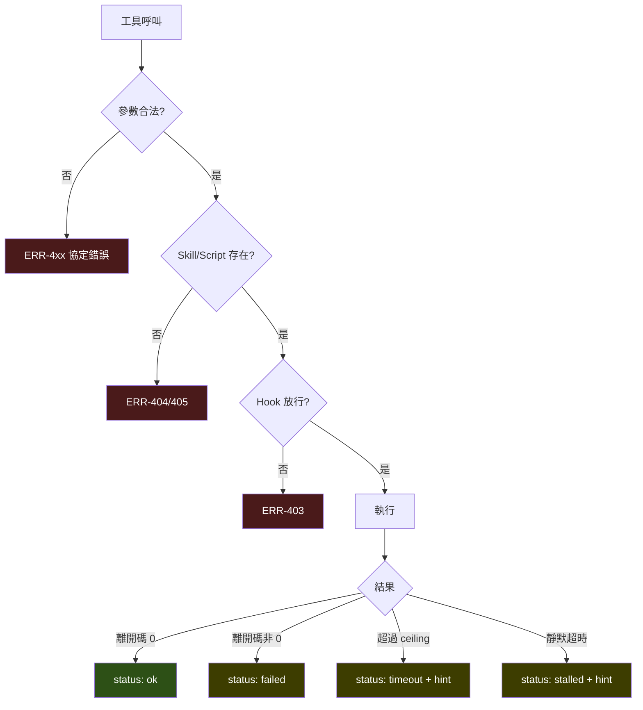

# RFC-06：錯誤模型

## 12.1 錯誤結構

所有錯誤 MUST 符合 [`schemas/error.schema.json`](schemas/error.schema.json)。

```json
{
  "code": "ERR-403",
  "category": "permission",
  "severity": "error",
  "retryable": false,
  "user_message": "pre-hook (skill) 拒絕此呼叫：payload 有 5000 bytes，上限 4096",
  "internal_message": "hook exit=1 skill=internal-api script=scripts/submit.sh",
  "recovery": "縮小 payload 後重試，或調整該 skill 的 hook 上限",
  "http_status": 403
}
```

**RFC-100** 每個錯誤 MUST 標示 `retryable`。

**理由**：呼叫端是 LLM，缺少此欄位時會對不可重試的錯誤反覆重試，燒掉
context 與時間。

**RFC-101** `user_message` MUST NOT 包含檔案系統絕對路徑、堆疊追蹤、
環境變數值或任何機密。

**RFC-102** `internal_message` MUST NOT 被傳回呼叫端。

## 12.2 錯誤碼總表

| 碼 | 類別 | 可重試 | HTTP | 意義 | 復原指引 |
|---|---|---|---|---|---|
| ERR-400 | validation | ✗ | 400 | 參數不符 schema | 依 schema 修正參數 |
| ERR-401 | validation | ✗ | 400 | 路徑逃逸 Bundle | 使用 Bundle 內的相對路徑 |
| ERR-402 | validation | ✗ | 400 | 副檔名不在直譯器白名單 | 改用 .sh/.py/.js |
| ERR-403 | permission | ✗ | 403 | Hook 拒絕 | 讀 `user_message` 的理由 |
| ERR-404 | not_found | ✗ | 404 | Skill 不存在 | 先呼叫 `list_skills` |
| ERR-405 | not_found | ✗ | 404 | Script 或檔案不存在 | 檢查 Card 的 `scripts` |
| ERR-406 | not_found | ✗ | 404 | 小節不存在 | 使用錯誤訊息附的標題清單 |
| ERR-410 | validation | ✗ | 400 | 呼叫端設定了禁用環境變數 | 只傳資料類變數 |
| ERR-411 | validation | ✗ | 413 | stdin 超過上限 | 分批或改由 Script 自行取得 |
| ERR-412 | validation | ✗ | 400 | 參數數量或長度超限 | 減少參數 |
| ERR-500 | internal | ✓ | 500 | 未預期的伺服器錯誤 | 重試一次；持續失敗請回報 |
| ERR-503 | resource | ✓ | 503 | 索引為空，服務未就緒 | 等待就緒；檢查 skill 路徑設定 |

**RFC-103** Script 的非零離開碼 MUST NOT 對應到任何 `ERR-` 碼。
它 MUST 以 `status: "failed"` 的正常回應表達。

**理由**：Script 失敗是資料，不是伺服器錯誤。把它變成協定錯誤會讓呼叫端
看不到 stderr，也無法據以判斷下一步。

**RFC-104** `timeout` 與 `stalled` 同樣 MUST NOT 對應 `ERR-` 碼，
MUST 以正常回應搭配 `hint` 表達。

## 12.3 錯誤與 status 的分界



**分界原則**：**呼叫發生之前**的問題是 `ERR-`；**執行之後**的結果是
`status`。

## 12.4 錯誤訊息品質

**RFC-105** 錯誤訊息 MUST 說明「為什麼被拒絕」，MUST NOT 只說明「被拒絕」。

| 不合規 | 合規 |
|---|---|
| `invalid path` | `path escapes the skill bundle: '../../etc/passwd'` |
| `timeout` | `Hit its 15s ceiling. Last output: 'POST /api/jobs'. 該 ceiling 表示此 script 應立即回應…` |
| `not allowed` | `environment variable 'PATH' cannot be set by the caller: it changes which program runs, not how it behaves` |

**RFC-106** 針對「找不到」類的錯誤，訊息 SHOULD 包含相近的候選項。
