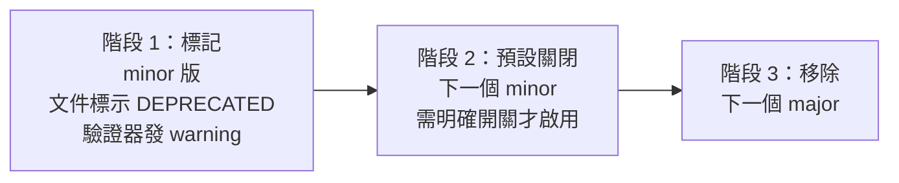

# RFC-08：相容性與版本

## 14.1 版本標的

| 標的 | 版本方案 | 宣告位置 |
|---|---|---|
| 本規範 | SemVer | `spec/README.md` 與驗證報告的 `spec_version` |
| Server 實作 | SemVer | `--version` 與 `/health` |
| 個別 Skill | SemVer | `manifest.version` |

## 14.2 何謂 Breaking Change

### 規範層級

| 變更 | 分類 |
|---|---|
| 新增 `MUST` 規則 | **major** |
| 將 `SHOULD` 升為 `MUST` | **major** |
| 新增 `SHOULD` 規則 | minor |
| 收緊既有規則的判準 | **major** |
| 放寬既有規則 | minor |
| 新增選用的 manifest 屬性 | minor |
| 移除或重新命名 manifest 屬性 | **major** |
| 修正文字、補充理由 | patch |

**RFC-130** 提高任何規則的嚴重度 MUST 視為 major 變更。

**理由**：既有的 Bundle 會從通過變成不通過。

### Server 層級

| 變更 | 分類 |
|---|---|
| 移除工具 | **major** |
| 工具新增必填參數 | **major** |
| 工具新增選用參數 | minor |
| 回應新增欄位 | minor |
| 回應移除欄位 | **major** |
| 回應欄位改變型別 | **major** |
| 改變預設值 | **major** |

**RFC-131** 改變任何預設值 MUST 視為 major 變更。

**理由**：預設值即契約。實測案例：`--context-tokens` 的預設值錯誤會讓
小 context 模型每次呼叫逾時；狀態目錄的預設值錯誤會讓唯讀容器中每支
Script 失敗。兩者都不需要使用者改任何設定就會發生。

### Skill 層級

| 變更 | 分類 |
|---|---|
| 改 `name` | **major** |
| 移除 script | **major** |
| script 新增必填參數 | **major** |
| 改 `description` | minor |
| 改 Body | minor |
| 縮短 `timeout` | **major** |
| 延長 `timeout` | minor |

## 14.3 棄用流程

**RFC-132** 棄用 MUST 經過三個階段，且 MUST NOT 跳過：



**RFC-133** 階段 1 到階段 3 之間 MUST 至少間隔一個完整的 minor 版本週期。

**RFC-134** 已棄用的規則 ID MUST 保留並標記 `DEPRECATED`，MUST NOT 被
重新指派。

## 14.4 版本協商

**RFC-135** Server MUST 在 `/health` 揭露其實作版本與所遵循的規範版本。

```json
{ "status": "ok", "skills": 7,
  "version": "1.2.0", "spec_version": "1.0.0" }
```

**RFC-136** Client MUST NOT 假設未在 `spec_version` 中宣告的行為。

## 14.5 擴充點

| 擴充點 | 機制 | 相容性 |
|---|---|---|
| 新的 Skill | 放入 Skill Root | 一律相容 |
| 自訂 manifest 屬性 | `x-` 前綴（RFC-046） | 一律相容 |
| 自訂驗證規則 | 組織自有的規則 ID 區段 | 需協調 |
| 額外的直譯器 | 擴充白名單 | **需安全審查** |

**RFC-137** 組織自訂的規則 ID MUST 使用 `X-` 前綴（如 `X-LINT-001`），
MUST NOT 佔用本規範的編號空間。

**RFC-138** 新增直譯器到白名單 MUST 經過安全審查並記錄於 ADR。

## 14.6 遷移

**RFC-139** 每個 major 版本 MUST 附帶遷移指南，其中 MUST 包含：

| 項目 | 要求 |
|---|---|
| 破壞性變更清單 | 每項對應規則 ID |
| 偵測方式 | 可執行的指令 |
| 修正方式 | 逐步操作 |
| 可否自動化 | 明確標示 |

**RFC-140** 若某項遷移可自動化，MUST 提供自動化工具。
