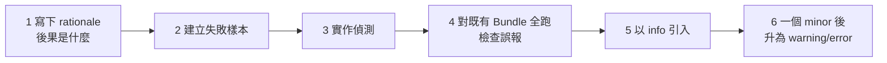

# RFC-10：Lint 規範

Lint 規則的完整清單見 [RFC-05 第 10.4 節](RFC-05-驗證.md)。本章定義規則
的**格式契約**與新增規則的流程。

## 17.1 規則定義的必要欄位

**RFC-170** 每條 lint 規則 MUST 定義下列欄位，缺一不可：

| 欄位 | 型別 | 說明 |
|---|---|---|
| `rule` | `LINT-nnn` | 永不重用 |
| `description` | string | 一句話說明違反了什麼 |
| `severity` | error/warning/info | 見 RFC-05 10.1 |
| `category` | string | manifest / script / body / filesystem |
| `rationale` | string | **為什麼**這是問題 |
| `detection` | 演算法描述 | 可據以獨立實作 |
| `autofix` | boolean | 可否機器修正 |
| `pass_example` | 程式碼 | 通過的樣本 |
| `fail_example` | 程式碼 | 失敗的樣本 |
| `rfc` | `RFC-nnn` | 對應的規範條文 |

**RFC-171** `rationale` MUST 說明後果，MUST NOT 只重述規則。

| 不合規 | 合規 |
|---|---|
| 「version 必須是 SemVer」 | 「非 SemVer 的版本無法比較，使相容性檢查無法自動化」 |

## 17.2 規則範本

```yaml
rule: LINT-001
description: manifest.version MUST 遵循 Semantic Versioning 2.0.0
severity: warning
category: manifest
rationale: >
  非 SemVer 的版本字串無法排序與比較，使自動化的相容性檢查（RFC-08）
  無法判斷變更是 major 還是 patch。
detection: |
  若 manifest 有 version 欄位，以 SemVer 2.0.0 的官方 regex 比對。
  不符即回報。
autofix: false
rfc: RFC-030
pass_example: |
  version: 1.2.0
  version: 2.0.0-rc.1
fail_example: |
  version: v1.2        # 有前綴、缺 patch
  version: 2026-08-06  # 日期不是 SemVer
```

## 17.3 輸出格式

**RFC-172** Linter MUST 支援 `text` 與 `json` 兩種輸出。

**RFC-173** `text` 輸出的每筆發現 MUST 包含規則 ID、路徑、訊息，
SHOULD 包含修正指引。

```
[error] SEC-010  requests 呼叫沒有 timeout：requests 完全沒有預設值，會永遠等下去
        skills/x/scripts/fetch.py
        依據 RFC-050
        → 加上 timeout=(連線, 讀取)
```

**RFC-174** `json` 輸出 MUST 符合 `validation-report.schema.json`。

## 17.4 誤報處理

**RFC-175** 誤報 MUST 視為**缺陷**，優先度 MUST NOT 低於漏報。

**理由**：誤報訓練使用者忽略 linter 輸出，使所有規則同時失效。實測案例：
三條規則因為對**註解內容**做模式比對而誤報，其中一條的目標註解正好在
說明「為什麼不該這樣寫」。

**RFC-176** 對原始碼做模式比對的規則 MUST 先移除註解。

**RFC-177** 跨行的設定（例如放在陣列變數中的命令列選項）MUST 以檔案為
範圍判斷，MUST NOT 只比對同一行。

## 17.5 新增規則的流程

**RFC-178** 新增 lint 規則 MUST 依序完成：



**RFC-179** 新規則 MUST 先以 `info` 引入至少一個 minor 版本週期，
才可提高嚴重度。

**理由**：直接以 `error` 引入會讓所有既有 Bundle 同時失效，實務上導致
規則被整體停用。
