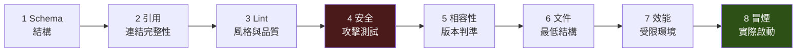

# RFC-11：CI 驗證管線

## 18.1 管線階段



**RFC-180** 階段 MUST 依序執行，前一階段失敗時後續階段 MUST NOT 執行。

**理由**：結構錯誤會使後續階段產生大量無意義的衍生錯誤，掩蓋真正的問題。

## 18.2 各階段定義

| # | 階段 | 指令 | 阻擋條件 | 逾時 |
|---|---|---|---|---|
| 1 | Schema | `spec.validate --level=L1` | 任何 error | 60 s |
| 2 | 引用 | 同上（VAL-022、VAL-050） | 任何 error | 60 s |
| 3 | Lint | `spec.validate --level=L2` | 任何 warning | 60 s |
| 4 | 安全 | `pytest -k "sec or traversal or symlink or env"` | 任何失敗 | 300 s |
| 5 | 相容性 | `spec.compat --base=<ref>` | 未標記的 breaking | 120 s |
| 6 | 文件 | 文件結構檢查 | 缺少必要小節 | 60 s |
| 7 | 效能 | 受限容器量測 | 超過門檻 | 900 s |
| 8 | 冒煙 | 啟動並打 `/ready` | 非 200 | 300 s |

**RFC-181** 階段 4（安全）MUST NOT 可被略過或標記為允許失敗。

**RFC-182** 階段 7（效能）MUST 在與正式環境相同的資源限制下執行。

## 18.3 GitHub Actions 範例

```yaml
name: spec-conformance
on: [push, pull_request]

jobs:
  conformance:
    runs-on: ubuntu-latest
    steps:
      - uses: actions/checkout@v4
      - uses: astral-sh/setup-uv@v3
      - run: uv sync --frozen

      - name: 1-2 結構與引用
        run: uv run python -m spec.validate skills/ --recursive --format=json
             | tee reports/structure.json

      - name: 3 Lint
        run: uv run python -m spec.validate skills/ --recursive --level=L2

      - name: 4 安全（不可略過）
        run: uv run pytest -q -k "sec or traversal or symlink or env or caller"

      - name: 5 相容性
        run: uv run python -m spec.compat --base=origin/main --format=json
             | tee reports/compat.json

      - name: 8 冒煙
        run: uv run python acceptance.py --smoke

      - name: 7 效能（受限環境）
        run: |
          docker build -t svc:ci .
          docker run -d --name ci --cpus=0.1 --memory=512m --read-only \
            -p 8000:8000 svc:ci --host=0.0.0.0
          timeout 180 bash -c 'until curl -sf localhost:8000/ready; do sleep 2; done'
          test "$(docker diff ci | wc -l)" -eq 0   # RFC-041：零檔案變更

      - uses: actions/upload-artifact@v4
        if: always()
        with: { name: conformance-reports, path: reports/ }
```

**RFC-183** CI MUST 保存驗證報告為 artifact，MUST NOT 只輸出到日誌。

### 相容性檢查的判準

`spec.compat` 只回報**事實**（什麼變了、屬於 RFC-08 §14.2 的哪一類）；
變更本身可不可接受由人決定。它唯一會讓 CI 失敗的情況是：

> 發生了破壞性變更，但該 skill 的 `version` 沒有提升 major。

**RFC-187** 破壞性變更 MUST 反映在版本號上。CI MUST 在未反映時失敗。

**理由**：變更是否合理需要脈絡，工具無法判斷；但「破壞了相容性卻沒有
標記」是客觀錯誤，且是最糟的失敗模式——呼叫端在下一次部署後突然壞掉，
而沒有任何文件說過會壞。

破壞性變更的偵測項目：

| 偵測 | 分類 | 影響 |
|---|---|---|
| skill 被移除（含改名） | breaking | 呼叫端用舊名稱會失敗 |
| 移除 script | breaking | 呼叫端可能正在使用 |
| 縮短 `timeout` | breaking | 原本跑得完的呼叫開始逾時 |
| 移除 tag | breaking | 依 tag 過濾的呼叫端找不到 |
| 新增 skill / script / tag | minor | 純新增 |
| 放寬 `timeout` | minor | 只會更寬鬆 |
| 變更 `description` | minor | 不影響 API |

## 18.4 報告格式

符合 [`schemas/validation-report.schema.json`](schemas/validation-report.schema.json)。

```json
{
  "spec_version": "1.0.0",
  "conformance_level": "L2",
  "passed": false,
  "target": "skills/",
  "findings": [
    {
      "rule": "SEC-010",
      "severity": "error",
      "path": "skills/x/scripts/fetch.py",
      "message": "requests 呼叫沒有 timeout：requests 完全沒有預設值，會永遠等下去",
      "rfc": "RFC-050",
      "remediation": "加上 timeout=(連線, 讀取)"
    }
  ],
  "summary": { "error": 1, "warning": 0, "info": 0 }
}
```

**RFC-184** 每筆 finding MUST 包含 `rule`、`path`、`message`，
SHOULD 包含 `rfc` 與 `remediation`。

## 18.5 效能回歸門檻

**RFC-185** CI MUST 在效能指標退化超過門檻時失敗：

| 指標 | 門檻 |
|---|---|
| `list_skills` p50 | 退化 > 50% |
| 冷啟動 | 退化 > 30% |
| 記憶體峰值 | 退化 > 25% |
| 容器檔案變更數 | **> 0 即失敗** |

**RFC-186** 容器檔案變更數的門檻 MUST 為零，MUST NOT 設定容忍值。

**理由**：RFC-041 是二元的。任何寫入都代表唯讀部署會失敗。
